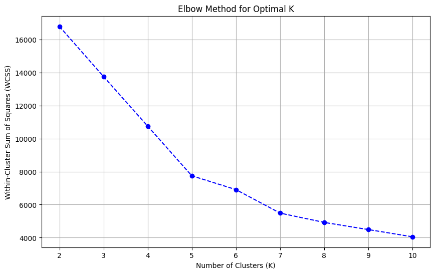
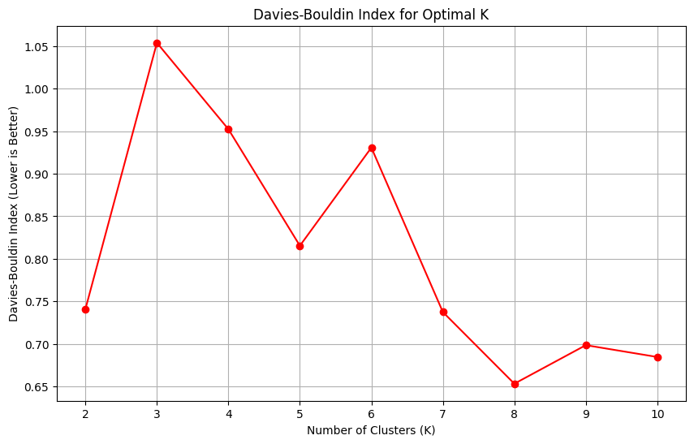
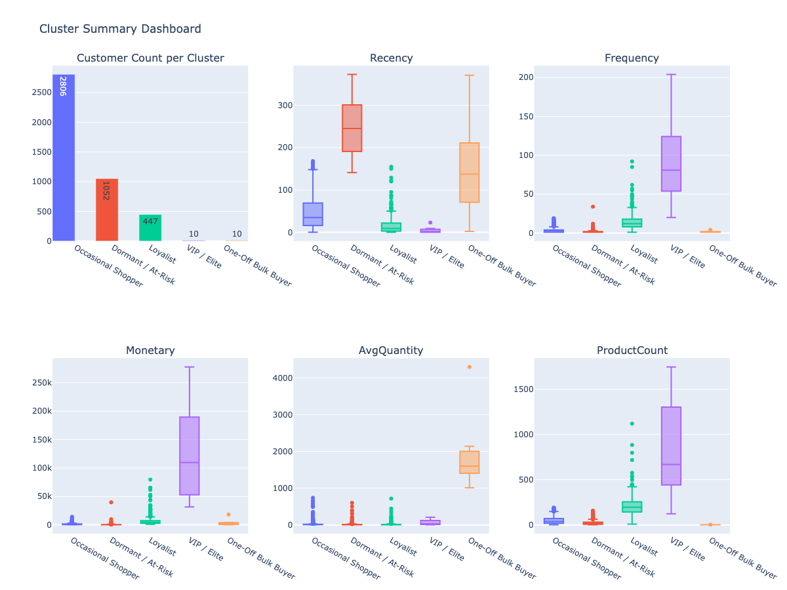
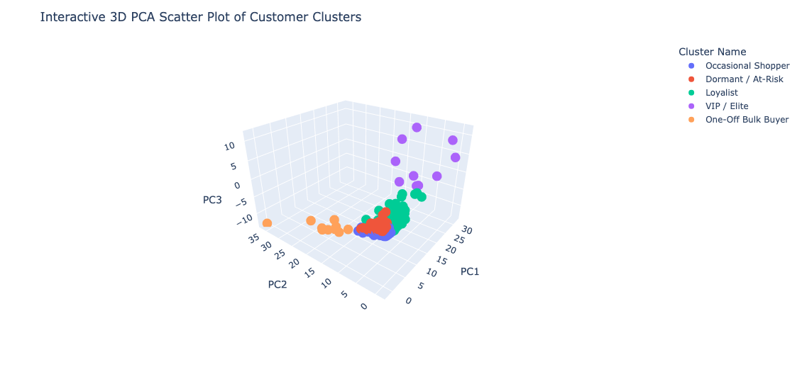

# Customer Segmentation with K-Means Clustering

This project demonstrates an end-to-end process for segmenting customers using transactional retail data from the [UCI Online Retail Dataset](https://doi.org/10.24432/C5BW33). The workflow includes data importing, cleaning, feature engineering, clustering with K-Means, and interactive visualization of customer segments. The goal is to identify distinct customer groups based on purchasing behavior to inform marketing strategies and enhance customer relationship management.

## Table of Contents:
- [Running the Colab Notebook](#running-the-colab-notebook)
- [Dependencies](#dependencies)
- [Data Gathering and Cleaning](#data-gathering-and-cleaning)
- [Handling Cancelled Orders](#handling-cancelled-orders)
- [Feature Engineering](#feature-engineering)
- [Customer Segmentation with K-Means](#customer-segmentation-with-k-means)
- [Cluster Analysis](#cluster-analysis)
- [Segmentation Visualizations](#segmentation-visualizations)
- [Next Steps](#next-steps)
- [Acknowledgments](#acknowledgments)

## Running the Colab Notebook:

To run the project in Google Colab:

1. Open the [customer_segmentation.ipynb](https://github.com/NikolaiMiranda/customer-segmentation-retail/blob/main/customer_segmentation.ipynb) notebook in Google Colab.
2. Install required dependencies.
3. Run all cells sequentially.

Note: Once you have run the cells, you can interact with the plots displayed under the "Segmentation Visualizations" section.

## Dependencies:
To run this project, install the following Python packages:
```bash
pip install pandas numpy scikit-learn matplotlib plotly ucimlrepo
```

## Data Gathering and Cleaning:
- **Dataset**: [UCI Online Retail Dataset (ucimlrepo, dataset ID 352)](https://doi.org/10.24432/C5BW33)
- Joined IDs and features tables into a single DataFrame
- Handled missing values by dropping rows without CustomerID
- Removed canceled orders by matching against originals and adjusting quantities
- Filtered out invalid transactions (e.g., UnitPrice = 0)

## Handling Cancelled Orders:
One of the most significant challenges in this dataset was dealing with canceled transactions. In the raw data, cancellations are logged as separate invoices prefixed with "C", which can distort customer purchase behavior if not properly reconciled.

### Approach:
A custom function `remove_cancellations(df)` was implemented to systematically adjust the dataset:
1. Separated cancellations and original transactions by checking if InvoiceNo started with "C".
2. Converted cancellation quantities to absolute values for subtraction from original order quantities.
3. Grouped cancellations across multiple records by key identifiers (StockCode, Description, UnitPrice, CustomerID, and Country) to aggregate all cancellations for the same item and customer.
4. Merged grouped cancellations back into the original dataset on those identifiers.
5. Adjusted original quantities by subtracting cancellation totals (`Quantity - Quantity_cancel`).
6. Removed rows with zero or negative quantities to exclude canceled purchases.

### Why It Matters:
Without this step, canceled items would inflate key metrics like Monetary Value, Frequency, and Quantity, leading to misleading RFM scores and cluster assignments. This reconciliation ensures the dataset reflects true customer purchasing behavior, providing a clean foundation for segmentation and marketing strategy.

## Feature Engineering:
Engineered customer-level features to capture purchasing behavior:
- **Recency**: Days since last purchase
- **Frequency**: Number of unique invoices
- **Monetary**: Total spend per customer
- **AvgQuantity**: Average quantity per transaction
- **ProductCount**: Number of unique products purchased

## Customer Segmentation with K-Means:
- Scaled features using `StandardScaler`
- Determined optimal `k` using:
  - Elbow Method (Within-Cluster Sum of Squares)
  
  - Davies-Bouldin Index (cluster separation)
  
- Selected `k=5` clusters for final segmentation
- Applied K-Means clustering and assigned each customer to a segment

## Cluster Analysis:
Cluster-level summary statistics:
- **Dormant / At-Risk**: Long time since last purchase, low spend 
- **Loyalist**: High frequency and monetary value 
- **VIP / Elite**: Small group of extremely high-value customers
- **Sporadic Bulk Buyers**: Rare but high-quantity purchases
- **Occasional Shoppers**: Largest segment, moderately frequent buyers, moderate spend

## Segmentation Visualizations:
- **Interactive Dashboard**: Customer counts and boxplots of behavioral features by cluster

- **3D Interactive PCA Plot**: Visual representation of clusters in reduced dimensional space


## Next Steps:
- Develop and implement targeted marketing campaigns for each segment, followed by A/B testing to evaluate their effectiveness in driving engagement, conversions, and revenue.
- Integrate additional data sources, such as customer demographics, website interactions, or external market trends, to enrich feature engineering and create more nuanced segments.

## Acknowledgments:
- **Dataset**: Chen, Daqing. "Online Retail." UCI Machine Learning Repository, 2015, https://doi.org/10.24432/C5BW33.
